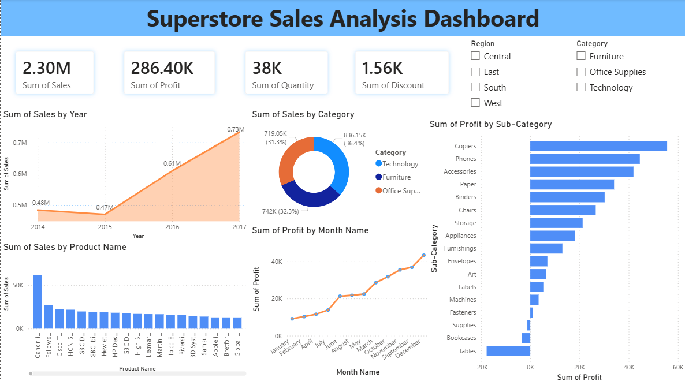

# Superstore Sales Analysis Dashboard

A comprehensive sales analytics dashboard built using Power BI to analyze sales performance, profit trends, product categories, and regional insights from Superstore data.

---

## 📌 Project Overview

The **Superstore Sales Analysis Dashboard** helps businesses monitor and analyze key performance indicators (KPIs) such as:

* Total Sales
* Total Profit
* Quantity Sold
* Discounts Offered
* Sales Trends Over Time
* Profit by Category & Sub-Category
* Product Performance
* Regional Analysis

This dashboard enables data-driven decision-making through interactive visualizations and filters.

---

## 📊 Dashboard Preview



---

## 🚀 Features

### ✔ KPI Cards

* Total Sales
* Total Profit
* Total Quantity
* Total Discount

### ✔ Interactive Filters

* Region-wise filtering
* Category-wise filtering

### ✔ Visual Insights

* Sales trend by year
* Profit by month
* Sales by category
* Profit by sub-category
* Product-wise sales comparison

### ✔ Business Insights

* Identify high-performing products
* Detect low-profit categories
* Understand seasonal profit trends
* Compare regional performance

---

## 🛠 Tools & Technologies Used

* **Power BI**
* **Microsoft Excel / CSV Dataset**
* **Data Cleaning & Transformation**
* **DAX (Data Analysis Expressions)**

---

## 📂 Project Structure

```bash
├── Dashboard_main.png        # Dashboard Screenshot
├── Superstore.pbix          # Power BI Dashboard File
├── dataset.csv              # Dataset Used
└── README.md                # Project Documentation
```

---

## 📈 Key Insights

* Technology category generated the highest sales.
* Copiers and Phones contributed the highest profits.
* Tables showed negative profit trends.
* Sales increased consistently from 2014 to 2017.
* Profit peaked during the later months of the year.

---

## 🎯 Objectives

* Analyze Superstore sales performance.
* Track profitability across categories.
* Visualize business KPIs effectively.
* Support strategic business decisions using data analytics.

---

## 📚 Skills Demonstrated

* Data Visualization
* Business Intelligence
* Dashboard Design
* Data Analysis
* DAX Calculations
* Interactive Reporting
* Data Cleaning

---

## 🔍 Future Improvements

* Add forecasting models
* Include customer segmentation analysis
* Integrate real-time data sources
* Add advanced drill-through reports

---

## 👨‍💻 Author

**Jatin Jajam**

If you like this project, feel free to ⭐ the repository and connect with me!

---

## 📜 License

This project is for educational and portfolio purposes.
